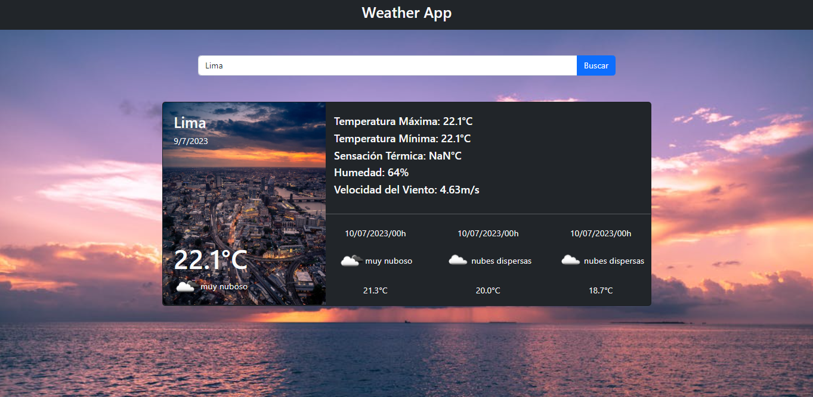

# Weather App

## Welcome! 👋

This is a React app where the weather of different cities you are looking for is shown in real time..

## Links!

  - Solution URL: https://mauricioc12.github.io/React-Weather-App/
  
## My process

Know how to consume a Rest API with React and use the different React Hooks to display the weather by cities.

## Built with: 

- React Js, React Hooks
- API Rest
- CSS custom properties, animations and transitions
- Responsive design
